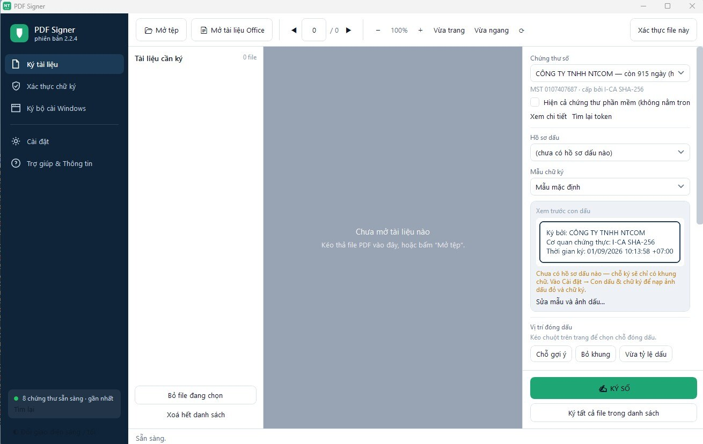
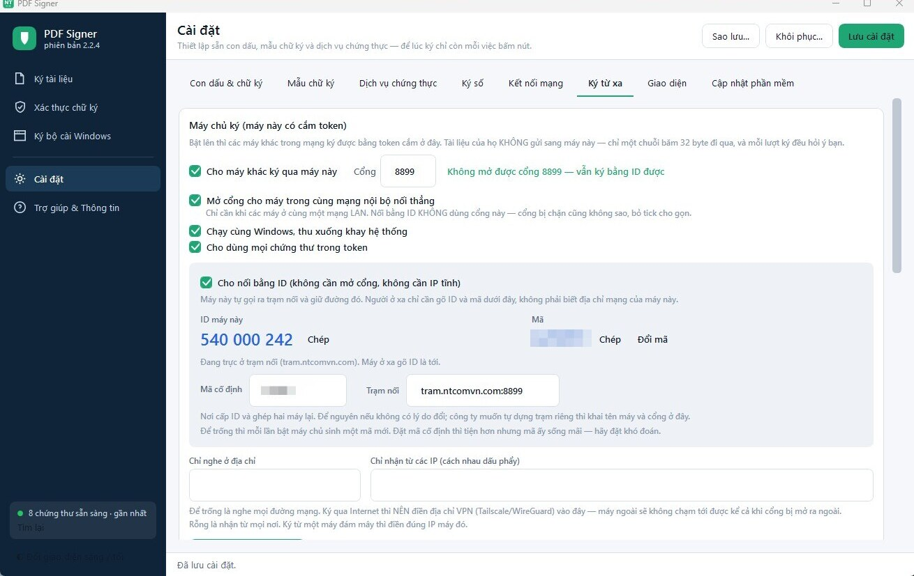
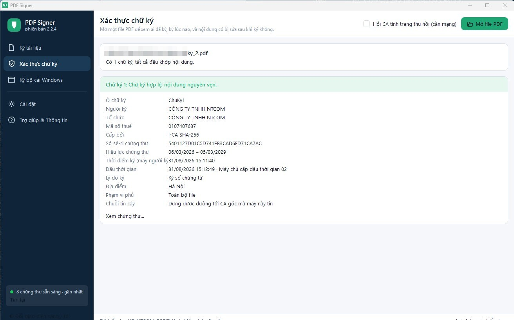
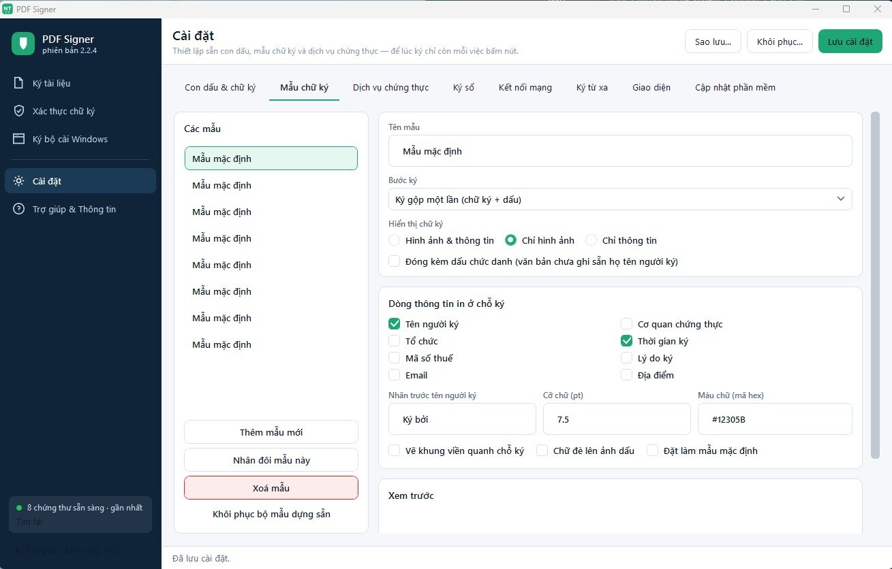
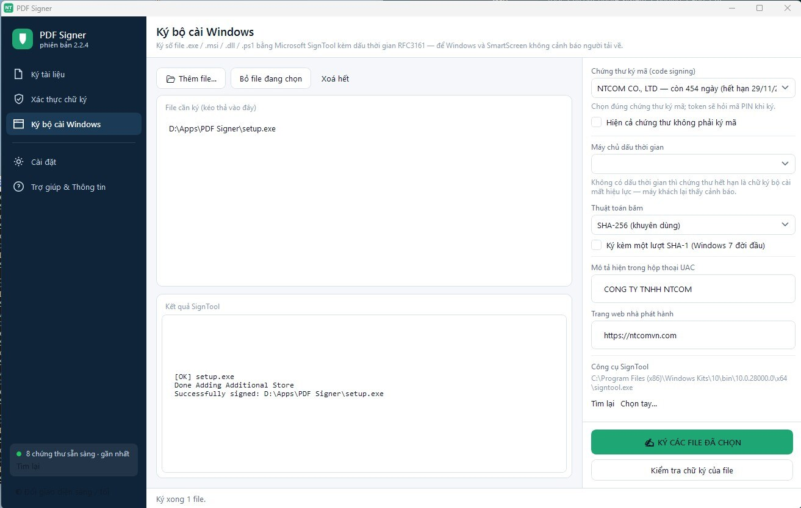
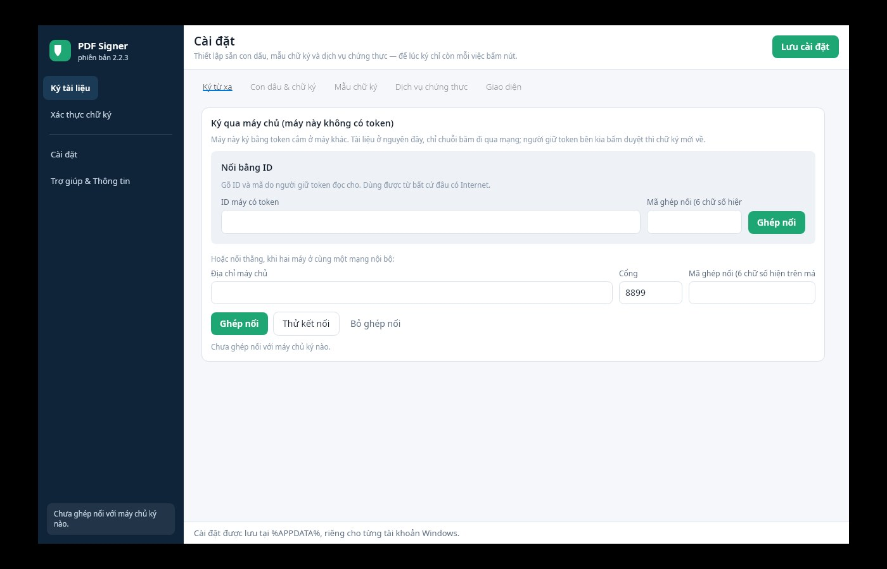

# PDF Signer

Phần mềm ký số tài liệu PDF cho **Windows và macOS**, dùng chứng thư số trong
USB token.

**Tài liệu không rời khỏi máy.** Việc ký diễn ra ngay trên máy người dùng, khoá bí
mật không rời khỏi token, mất mạng vẫn ký được. Phần mềm không gửi tài liệu lên
bất kỳ máy chủ nào.

  <a href="https://github.com/nhcntcom-rgb/PDFSigner/releases/latest">
    <b>⬇ Tải bản mới nhất</b>
  </a>

---

## Tải và cài

**Windows**

| File | Dùng khi |
|---|---|
| **`setup.exe`** | Cài bình thường. Bộ cài đầy đủ, có cả phần gỡ cài đặt. |
| `PDFSigner.zip` | Máy chặn chạy file `.exe` lạ: giải nén ra rồi chạy `PDFSigner.exe`. |
| `PDFSigner-capnhat.zip` | Gói vá — phần mềm tự tải khi cập nhật, **không cần tải tay**. |

Yêu cầu: Windows 10 hoặc mới hơn (64 bit). Bộ cài tự kèm .NET Runtime, không phải
cài thêm gì.

**macOS**

| File | Dùng khi |
|---|---|
| **`PDFSigner-mac-osx-arm64.zip`** | Máy Apple Silicon (M1 trở lên). |
| **`PDFSigner-mac-osx-x64.zip`** | Máy Mac chạy chip Intel. |

Giải nén rồi kéo **PDF Signer** vào thư mục Applications. Yêu cầu macOS 11 trở lên.
Không rõ máy mình loại nào thì mở Terminal gõ `uname -m`: ra `arm64` là Apple
Silicon, ra `x86_64` là Intel.

Bản macOS **ký nhờ token cắm ở một máy Windows** — trên macOS, USB token của các
nhà cung cấp trong nước chưa dùng trực tiếp được. Xem mục "Ký từ xa" bên dưới.

**Chữ ký của bộ cài**

Bản Windows ký bằng chứng thư **OV code signing**: bấm chuột phải vào `setup.exe`
→ **Properties → Digital Signatures** để đối chiếu nhà phát hành trước khi chạy.

Bản macOS ký bằng **Developer ID** của Apple và đã qua **công chứng
(notarization)**, nên mở như mọi phần mềm bình thường — không phải bấm chuột phải
→ Open, cũng không phải vào System Settings gỡ chặn.

## Cập nhật

Phần mềm tự hỏi trang phát hành này xem có bản mới không, và **vá tại chỗ**: chỉ
tải phần đã đổi (vài trăm KB) rồi thay, không bắt cài lại từ đầu. Cấu hình, mẫu
chữ ký và ảnh con dấu giữ nguyên.

Muốn tự kiểm: **Cài đặt → Cập nhật phần mềm → Kiểm tra ngay**.

Gói vá tải về được kiểm hai lớp trước khi thay file — băm SHA-256 phải khớp, và
file trong gói phải ký số cùng nhà phát hành với bản đang chạy. Thiếu một trong
hai là bỏ gói.

## Làm được gì

**Ký PDF**

- Ký theo chuẩn PAdES, ghi thêm vào file (incremental) nên **chữ ký của người ký
  trước vẫn còn nguyên giá trị** — nhiều người ký nối tiếp vào một văn bản được.
- Kéo thả để đặt ô chữ ký, nhìn thấy con dấu ngay trong lúc kéo.
- Con dấu đỏ, chữ ký tay, dấu chức danh — ghép sẵn thành mẫu, ký lần sau chỉ chọn mẫu.
- Ký hàng loạt nhiều file một lượt.
- Dấu thời gian RFC3161 (TSA), kiểm chuỗi tin cậy, kiểm thu hồi CRL/OCSP.
- Xác thực chữ ký: ai ký, ký lúc nào, file có bị sửa sau khi ký không.

**Ký file cài đặt Windows**

- Ký Authenticode qua Microsoft SignTool, kèm dấu thời gian.

**Ký từ xa — chỉ cần một dãy số**

Cả công ty dùng chung một USB token, không phải chuyền tay nhau.

- Máy cắm token bật *"Cho máy khác ký qua máy này"*, màn hình hiện một **ID chín
  chữ số** và một **mã**. Máy ở xa (Windows hay macOS) gõ hai số đó là ký được —
  giống cách TeamViewer nối máy.
- **Không phải mở cổng, không phải NAT, không cần IP tĩnh.** Máy cắm token tự gọi
  ra ngoài, nên nó nằm sau router nào cũng được.
- ID **gắn với máy**: cài lại phần mềm hay đổi tài khoản Windows, ID vẫn y nguyên.
  Mã thì mỗi lần bật sinh một mã mới, hoặc tự đặt mã cố định.
- Hai máy ở cùng mạng nội bộ thì nối thẳng bằng địa chỉ IP, không cần Internet.

**Vẫn an toàn:** tài liệu KHÔNG rời khỏi máy người soạn — thứ chạy qua mạng chỉ là
một chuỗi băm vài chục byte. Khoá bí mật không rời khỏi token. Đường truyền là TLS
có ghim vân tay chứng thư, và **mỗi lượt ký đều phải người giữ token bấm duyệt**,
nhìn rõ ai đang xin ký file gì.

*Màn hình trên máy cắm token. Người ở xa chỉ cần hai con số này. (Mã trong ảnh đã
được che.)*

**Khác**

- Giao diện tiếng Việt / tiếng Anh, nền sáng / nền tối.
- Chạy qua proxy của cơ quan.
- Đọc được file Office (Word, Excel) — chuyển sang PDF rồi ký.

## Vài màn hình khác

**Xác thực chữ ký** — mở một file đã ký để xem ai ký, ký lúc nào, nội dung có bị
sửa sau khi ký không.

**Mẫu chữ ký** — dựng sẵn cách hiển thị chỗ ký: hình dấu, dòng thông tin nào hiện
ra, cỡ chữ, màu chữ. Ký lần sau chỉ việc chọn mẫu.

**Ký bộ cài Windows** — ký Authenticode cho file `.exe` / `.msi` / `.dll` qua
Microsoft SignTool, kèm dấu thời gian.

**Bản macOS** — cùng bộ tính năng ký PDF, ký nhờ token cắm ở máy Windows.

## Câu hỏi hay gặp

**Có phải trả tiền không?** Không. Tải về dùng.

**Có gửi tài liệu của tôi đi đâu không?** Không. Phần mềm chỉ gọi ra ngoài trong
ba việc: hỏi bản mới ở trang này, xin dấu thời gian từ máy chủ TSA (nếu bật), và
kiểm thu hồi chứng thư (nếu bật). Tài liệu không đi kèm trong bất cứ việc nào.

**Windows báo "Windows protected your PC"?** Bộ cài ở đây đã ký số nên bình thường
không gặp. Nếu gặp, kiểm lại chữ ký như hướng dẫn ở trên — file tải từ nơi khác có
thể không phải bản gốc.

**Máy tôi không có token thì ký được không?** Ký qua máy khác có token — xem mục
"Ký từ xa".

**Dùng trên macOS được không?** Được, có bản riêng cho Apple Silicon và Intel.
Máy Mac ký qua một máy Windows có cắm token (trên macOS, USB token của các nhà
cung cấp trong nước chưa dùng trực tiếp được) — gõ ID và mã là xong.

## Liên hệ

Phần mềm do **Công ty TNHH NTCOM** phát triển.

- Địa chỉ: Số 2 Hoàng Ngọc Phách, Phường Láng, TP. Hà Nội, Việt Nam
- Điện thoại: 024 6675 5558 · Di động: 0986.397.886 (Zalo/WhatsApp/Viber)
- Email: nguyen.cuong@ntcomvn.com
- Website: https://ntcomvn.com

Lỗi hoặc góp ý: mở [Issue](https://github.com/nhcntcom-rgb/PDFSigner/issues) hoặc
gửi email.

---

<b>English</b>

**PDF Signer** — a desktop app for digitally signing PDF documents on Windows using
certificates stored on a USB token.

Documents never leave the machine: signing happens locally, the private key never
leaves the token, and it works offline.

Download the latest build from the
[Releases page](https://github.com/nhcntcom-rgb/PDFSigner/releases/latest).
Requires Windows 10+ (64-bit); the installer bundles the .NET runtime. Installers
are Authenticode-signed — check the publisher under *Properties → Digital
Signatures* before running.

Features: PAdES incremental signing (earlier signatures stay valid), drag-and-drop
signature placement with live seal preview, red company seals and handwritten
signature images, batch signing, RFC3161 timestamps, trust-chain and revocation
checking, signature verification, Authenticode signing via Microsoft SignTool, and
remote signing — a machine with the token approves each signature request from
remote Windows or macOS clients over pinned TLS. Vietnamese and English UI, light
and dark themes.

Developed by NTCOM Co., Ltd. Contact: nguyen.cuong@ntcomvn.com

